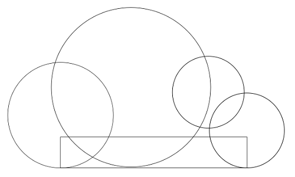
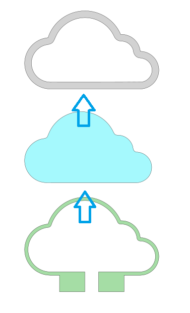
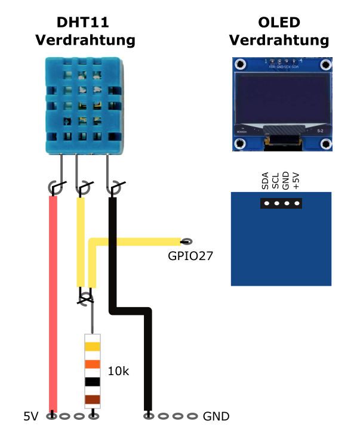

# Cloudya
Internetuhr, Wetterstation und RGB-Cloud

## Story
Diese Anleitung beschreibt den Aufbau der Internetuhr "Cloudya". Sie beinhaltet die Internetzeit, Sommer/Winterzeitumstellung, Weckfunktion, eine RGB-LED Cloud, einen WLAN-Manager und einen WEB-Server. Die Zeit- und Datumsanzeige erfolgt über ein 4-Digit TM1637 Display und ein OLED-Display. Die RGB-LED Cloud ist über den WEB-Server steuerbar, ebenso die Weckzeit, die Helligkeit des Displays und der RGB-LEDs.
Für die Einstellung der WLAN-Daten steht ein WLAN-Manager zur Verfügung. Nachdem in den Netzwerkeinstellungen des Handys/Tablet die "Cloudya" ausgewählt wurde, kann über die IP-Adresse 192.168.4.1 der WLAN-Manger gestartet und die WLAN-Zugangsdaten eingetragen werden. Sind die WLAN-Zugangsdaten korrekt, startet Claudya automatisch. Über die angezeigte IP-Adresse im OLED-Display ist der WEB-Server aufrufbar. Die Einstellungen sind jetzt über den WEB-Server möglich.

## Hardware

| Anzahl | Bezeichnung | 
| -------- | -------- | 
|  1 | ESP32 NodeMCU D1 R32   |
|  1 |  ESP32 NodeMCU D1 R32 Shield |
|  1 |  Sperrholzplatte 300x600 x 4mm  |
|  1 |   Cloudfolie weiß DIN A4 |
| 8  |  Platinenhalter (3D-Druck) |
|  2 |   KY-012 Piezo Buzzer |
|  1 |  4-digits TM1637 Display 0,56" weiß  |
|  1 |  1,3 Zoll OLED Display I2C SSH1106 Chip  |
|  1 |  WS2812B LED Strip (NeoPixel)  |
| 1  |   JST Stecker/Buchse |
| 1  |   4polige Crimpverbindung |
|  2 |  Stift/Buchsenleiste  |
|   | Schaltdraht, Kleber, Kleinmaterial   |
| ---  | ---    |

## Aufbau und Montage

### Die Cloud-Vorlage für den Lasercutter besteht aus:

### Die fertige Wolke besteht aus 5 Einzelteilen (4mm Sperrholz, L=140, Dicke: 20mm) und 2 Wolkenfolien:

### Erstelle die Wolkenteile mit Inkscape:

Zeichne mit den Abmessungen 140x85mm die Kreise der Wolke und unten ein Rechteck.

### Markiere alles und bilde die Vereinigung. Pfad, Vereinigung (Strg++).

### Dupliziere die Wolke 3x (Strg+D): 1x Sicherheitskopie und lege 2 Wolken deckungsgleich übereinander. Wähle eine Wolke aus und bilde den dynamischen Versatz. Pfad - Dynamischer Versatz (Strg+J)

### Markiere alles und bilde die Differenz - Pfad-Differenz (Strg+-). Dupliziere die Wolke 2x (Strg+D).

### Erstelle mit der ersten Sicherheitskopie eine weitere Wolke mit einem kleineren Rand. Verwende erneut den dynamischen Versatz (Strg+J). Kopiere die Wolke 2x

### Zeichne ein Rechteck mit den Maßen 70x21mm und lege es unten auf die innere Wolke. Verbinde den schmalen Rahmen mit dem Rechteck- Pfad Vereinigung (Strg++)

![Bild]/pic/wolke10.png)

### Zeichen ein Rechteck mit 15mm Breite, lege es mittig in die Wolke und bilde die Differenz (Strg+-)

### Kopiere die Wolke 3x

### Jetzt sind alle Einzelteile fertig gezeichnet. Fertige von allen Zeichnungen eine Kopie und lege sie zur Kontrolle übereinander. Die Konturen der Wolken müssen deckungsgleich sein.

### Die Wolken-Elemente liegen jetzt übereinander

### Jetzt sind alle Wolkenteile als Vorlage für den Lasercutter erstellt

![Bild]/pic/wolke01.png)

### 3D-Druck, sieben Abstandshalter drucken
+ Die Abstandshalter tragen den ESP32, das 4-Digit-Display und das OLED-Display. Sie werden auf den ESP32, auf das 4-Digit-Display und auf das OLED-Display geklebt..
+ Erstelle die Abstandshalter mit Tinkercad.
+ Der Abstandshalter für das OLED-Display hat die Maße 44x34x2mm Der 1. Durchbruch hat das Maß 36x24x2 und der 2. Durchbruch hat das Maß 2x17x50

## Verdrahtung
+ OLED-Display 1,3": VDD an V, GND an G, SCK an SCL, SDA an SDA,
+ 4-stellige LED 0.56 Display: CLK an D18, DIO an D5, 5V an 5V, GND an GND
+ LED-Stripe: Data an D14, 5V an 5V, GND an GND
+ Buzzer Wecken  D4 und GND
+ Buzzer Gas D26 und GND
+ led_rot 25
+ led_gelb 17
+ led_gruen 16
+ DHT11  5V, GND, OUT an IO27
+ Gas Sensor MQ135 IO39 AO an IO39, 5V und GND; MQ135 eichen!

### ESP32 Shield

### LED Display

  ### DHT11

  ### LED Stripe

## Inbetriebnahme:

  1. Versorge deine Cloudya mit Strom
  2. Warte bis das "Cloudya" WLAN erscheint (Einstellungen, WLAN, Meine Netzwerke)
  3. Verbinde dich mit dem "Cloudya" WLAN und gebe 192.168.4.1 in der Adresszeile deines Webbrowsers ein (KEINE WEB/GOOGLE SUCHE)
  4. Du solltest jetzt ein Webinterface sehen in dem du den Namen und das Passwort deines Heimnetzwerks eingeben kannst
  5. Wenn du jetzt "Speichern" drückst, sollte sich deine Cloudya mit deinem Heimnetzwerk verbinden
  6. Die IP Adresse wird nach dem Reboot im OLED Display und im Seriellen Monitor angezeigt.
  7. Du kannst jetzt das Webinterface zur Steuerung des Lichts etc. aufrufen indem du die IP Adresse deiner Cloudya in der Adresszeile deines Webbrowsers eingibst.

   
<ol class="breadcrumb" style="border-top: 2px solid black;border-bottom:2px solid black; height: 45px; width: 900px;"> 
<a href="#oben">nach oben</a>
</ol>
</div
